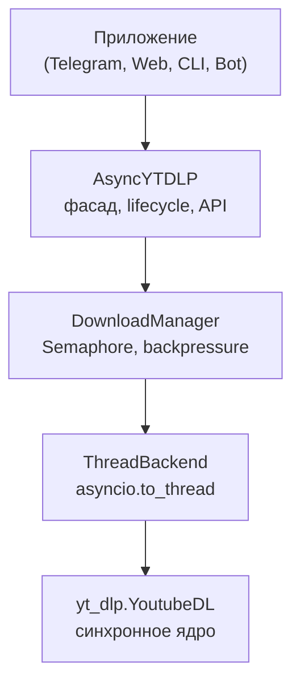

# async-yt-dlp

[](https://github.com/baton-spb/async-yt-dlp/actions)
[](https://pypi.org/project/async-yt-dlp/)
[](https://www.python.org/downloads/)
[](https://peps.python.org/pep-0561/)
[](LICENSE)

Строго типизированная асинхронная обёртка над [yt-dlp](https://github.com/yt-dlp/yt-dlp) для Python 3.11+.

Все блокирующие операции yt-dlp выполняются через `asyncio.to_thread`, поэтому event loop не блокируется. Подходит для Telegram-ботов, Discord-ботов, веб-сервисов (FastAPI, Litestar, aiohttp) и фоновых очередей задач.

---

## Возможности

- **Асинхронность**: блокирующие вызовы yt-dlp вынесены в `asyncio.to_thread`, event loop свободен.
- **Типизация**: модели `MediaInfo`, `FormatInfo`, `DownloadResult`, `ProgressEvent` — frozen dataclass со `slots=True`. PEP 561 `py.typed`, совместимо с `mypy --strict`.
- **Потокобезопасность**: каждая операция получает изолированный экземпляр `YoutubeDL`.
- **Стриминг прогресса**: асинхронный генератор `download_with_progress` с адаптивным троттлингом.
- **Контроль параллельности**: `DownloadManager` на базе `asyncio.Semaphore` с ограничением очереди (backpressure).
- **Отмена и таймауты**: корректная обработка `task.cancel()`, `asyncio.timeout` и graceful shutdown.
- **Объектная конфигурация**: `FormatSelector` (fluent-построитель форматов), `OutputTemplate` (построитель шаблонов имён файлов), `VideoContainer` (выбор контейнера).
- **Маскировка данных**: пароли, токены, cookies и прокси автоматически скрываются в логах.
- **Диагностика окружения**: `check_dependencies()` проверяет наличие `yt-dlp`, `ffmpeg`, `ffprobe` и JS-движков.
- **Автоматический EJS (JS runtimes)**: автоматическое обнаружение Node.js, Deno, Bun в системе для работы YouTube без троттлинга (`auto_detect_js=True`).
- **Чистые логи**: служебные предупреждения ядра yt-dlp фильтруются (`no_warnings=True`), не засоряя консоль.

---

## Установка

Требуется Python **3.11+**.

```bash
# Базовая установка:
pip install async-yt-dlp

# С интеграцией aio-ffmpeg (постобработка видео):
pip install "async-yt-dlp[ffmpeg]"

# Полный набор (aio-ffmpeg + curl-cffi, websockets и др.):
pip install "async-yt-dlp[full]"
```

Или через `uv`:
```bash
uv add async-yt-dlp
```

---

## Быстрый старт

### 1. Извлечение метаданных

```python
import asyncio
import sys
from async_yt_dlp import AsyncYTDLP

# Корректный вывод Unicode/эмодзи в консоли Windows
if sys.stdout.encoding != "utf-8":
    sys.stdout.reconfigure(encoding="utf-8")


async def main() -> None:
    async with AsyncYTDLP() as ytdlp:
        info = await ytdlp.extract_info("https://www.youtube.com/watch?v=BaW_jenozKc")
        print(f"Название: {info.title}")
        print(f"Автор: {info.uploader}")
        print(f"Длительность: {info.duration_seconds} сек.")


asyncio.run(main())
```

### 2. Скачивание видео

```python
import asyncio
from pathlib import Path
from async_yt_dlp import AsyncYTDLP, YTDLPOptions, FormatSelector, OutputTemplate, VideoContainer


async def main() -> None:
    options = YTDLPOptions(
        format=FormatSelector.preset_720p(container=VideoContainer.MP4),
        container=VideoContainer.MP4,
        output_path=Path("./downloads"),
        output_template=OutputTemplate.title_only(),
    )

    async with AsyncYTDLP(default_options=options) as ytdlp:
        result = await ytdlp.download("https://www.youtube.com/watch?v=BaW_jenozKc")
        print(f"Файл: {result.filepath} ({result.file_size} байт)")


asyncio.run(main())
```

### 3. Стриминг прогресса загрузки

```python
import asyncio
from async_yt_dlp import AsyncYTDLP, DownloadStatus


async def main() -> None:
    async with AsyncYTDLP() as ytdlp:
        async for event in ytdlp.download_with_progress(
            "https://www.youtube.com/watch?v=BaW_jenozKc",
            throttle_interval=0.2,
        ):
            if event.status == DownloadStatus.DOWNLOADING:
                line = f"Загрузка: {event.percent:.1f}% | {event.speed_str} | ETA: {event.eta_str}"
                # \033[K очищает остаток строки, ljust(70) исключает наложение старых символов
                print(f"\r\033[K{line:<70}", end="", flush=True)
            elif event.status == DownloadStatus.POST_PROCESSING:
                if event.postprocessor_status == "started":
                    print(f"\r\033[KПостобработка: {event.postprocessor}...", flush=True)
            elif event.status == DownloadStatus.COMPLETE:
                print("\r\033[KЗагрузка успешно завершена!", flush=True)


asyncio.run(main())
```

---

## Объектная конфигурация

### FormatSelector — построитель строки `--format`

```python
from async_yt_dlp import FormatSelector, VideoContainer

# Универсальный выбор любого разрешения:
FormatSelector.resolution(720, container=VideoContainer.MP4)
FormatSelector.resolution(1080, container=VideoContainer.MP4, fps=60)

# Готовые пресеты (144p .. 4K/8K):
FormatSelector.preset_720p(container=VideoContainer.MP4)  # 720p HD
FormatSelector.preset_1080p(container=VideoContainer.MP4) # 1080p Full HD
FormatSelector.preset_4k(container=VideoContainer.MP4)    # 4K UHD
FormatSelector.preset_audio_only("mp3")                   # только аудио (mp3, m4a, flac)
FormatSelector.preset_max_quality()                       # максимальное качество

# Ручная сборка (fluent builder):
fmt = FormatSelector.video().max_height(480).ext("mp4").merge(FormatSelector.audio())
```

### OutputTemplate — построитель шаблона имени файла

```python
from async_yt_dlp import OutputTemplate

# Готовые пресеты:
OutputTemplate.title_only()         # "%(title)s.%(ext)s"
OutputTemplate.title_and_id()       # "%(title)s [%(id)s].%(ext)s"
OutputTemplate.dated()              # "%(upload_date)s - %(title)s.%(ext)s"
OutputTemplate.playlist_folder()    # "%(playlist_title)s/%(playlist_index)02d - %(title)s.%(ext)s"
OutputTemplate.channel_folder()     # "%(uploader)s/%(upload_date)s - %(title)s.%(ext)s"

# Ручная сборка через fluent-API:
tpl = OutputTemplate().channel().dir().title().ext()  # "%(channel)s/%(title)s.%(ext)s"

# Операторы:
tpl = OutputTemplate().channel() / OutputTemplate.title_only()  # то же самое
```

### VideoContainer — гарантия формата выходного файла

```python
from async_yt_dlp import VideoContainer, YTDLPOptions

# Гарантирует .mp4 на выходе (ffmpeg remux без перекодирования):
options = YTDLPOptions(container=VideoContainer.MP4)
# Доступные: MP4, MKV, WEBM, MOV, AVI, FLV, TS
```

---

## Архитектура



---

## Примеры использования

В каталоге [`examples/`](examples/) представлены готовые примеры:

- [`simple_extract.py`](examples/simple_extract.py) — извлечение метаданных
- [`simple_download.py`](examples/simple_download.py) — скачивание файла
- [`progress.py`](examples/progress.py) — отображение прогресса
- [`playlist.py`](examples/playlist.py) — работа с плейлистами
- [`audio_extraction.py`](examples/audio_extraction.py) — извлечение аудио
- [`postprocessing_pipeline.py`](examples/postprocessing_pipeline.py) — постобработка через aio-ffmpeg
- [`custom_options.py`](examples/custom_options.py) — настройка параметров
- [`cancellation.py`](examples/cancellation.py) — отмена задач и таймауты
- [`concurrency.py`](examples/concurrency.py) — параллельная загрузка

---

## Лицензия

Проект распространяется под лицензией MIT. См. файл [LICENSE](LICENSE).
