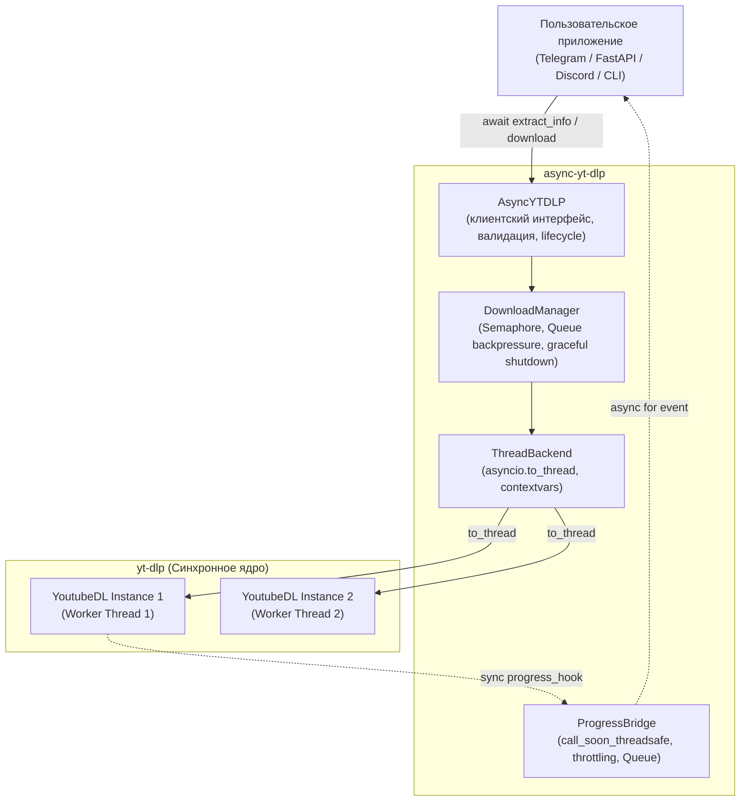
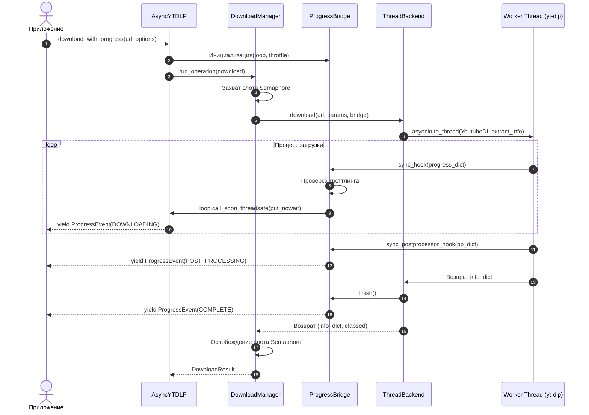

# Архитектура async-yt-dlp

В данном документе детально описано внутреннее устройство библиотеки `async-yt-dlp`,
ее слои абстракции, модели параллельности, механизм передачи прогресса и управление жизненным циклом.

---

## 1. Обзор слоев и компонентов

### Ответственность компонентов:

1. **`AsyncYTDLP` (`client.py`)**:
   - Точка входа для прикладного кода.
   - Управление жизненным циклом (`ClientState`: `NEW` -> `RUNNING` -> `CLOSING` -> `CLOSED`).
   - Валидация входных данных (URL, схемы, пути).
   - Слияние параметров (дефолтные + опции конкретной операции).
   - Трансляция результатов в типизированные структуры (`MediaInfo`, `DownloadResult`).

2. **`DownloadManager` (`manager.py`)**:
   - Ограничение конкурентности с помощью `asyncio.Semaphore(max_concurrency)`.
   - Защита от перегрузки очереди (`queue_size` backpressure).
   - Учет всех активных задач `asyncio.Task`.
   - Корректный `shutdown` с ожиданием завершения фоновых воркеров.

3. **`ThreadBackend` (`backend.py`)**:
   - Изолированное создание экземпляра `yt_dlp.YoutubeDL` на каждую операцию.
   - Делегирование блокирующих вызовов в системные потоки через `asyncio.to_thread()`.
   - Подключение адаптеров логирования и перехвата хуков.
   - Преобразование внутренних исключений yt-dlp в типизированные ошибки `AsyncYTDLPError`.

4. **`ProgressBridge` (`progress.py`)**:
   - Потокобезопасная отправка данных из worker thread в asyncio loop через `loop.call_soon_threadsafe()`.
   - Троттлинг промежуточных событий `DOWNLOADING`.
   - Ограниченная очередь (`Queue(maxsize)`) для защиты от утечек памяти.

---

## 2. Диаграмма последовательности: Скачивание со стримингом прогресса

---

## 3. Почему именно Thread Backend, а не Subprocess

При проектировании библиотеки рассматривались два основных подхода:

| Критерий | Thread Execution (`asyncio.to_thread`) | Subprocess Execution (`yt-dlp CLI`) |
| :--- | :--- | :--- |
| **Доступ к Python API** | **Полный прямой доступ** ко всем методам и хукам | Только текстовый CLI интерфейс |
| **Прогресс-события** | Мгновенные структурированные словари через хуки | Необходимость сложного и нестабильного парсинга stdout |
| **Постобработка** | Прямые postprocessor hooks (`POSTPROCESS_WHEN`) | Невозможно отследить промежуточные стадии |
| **Метаданные** | Полный `info_dict` со всеми полями, форматами и субтитрами | Ограничен возможностями `--dump-json` |
| **Производительность** | Минимальный оверхед (вызовы внутри одного процесса) | Затраты на спавн тяжелого процесса Python на каждый вызов |
| **Кастомные коллбэки** | Поддержка `match_filter`, кастомных форматов и логгеров | Не поддерживаются |

**Вывод:** Использование потоков ОС в сочетании с отдельным экземпляром `YoutubeDL` на каждую операцию обеспечивает максимальную функциональность и наивысшую производительность.

---

## 4. Потокобезопасность: Один экземпляр YoutubeDL на операцию

Анализ исходного кода `yt-dlp` показал, что класс `YoutubeDL` содержит множество изменяемых атрибутов уровня экземпляра:
- `self._download_retcode`: инкрементируется при любых сбоях.
- `self._num_downloads`: счетчик обработанных файлов.
- `self._request_director`: HTTP-сессия.
- `self.params`: словарь параметров, модифицируемый во время работы.

Попытка параллельного использования одного экземпляра `YoutubeDL` из разных потоков неизбежно приводит к race conditions и искажению результатов.

**Решение:**
`ThreadBackend` создает **новый изолированный экземпляр `YoutubeDL`** на каждый отдельный вызов `extract_info` или `download`. Экземпляры не разделяют состояние, что гарантирует 100% потокобезопасность.

---

## 5. Модель отмены (Cancellation)

Отмена асинхронных задач в Python (`task.cancel()`) генерирует исключение `asyncio.CancelledError` в точке `await`.

> [!WARNING]
> Отмена `asyncio.Task` **не прерывает физически** уже запущенный в ОС системный поток CPython, если в нем выполняется блокирующий синхронный вызов ядра `yt-dlp`.

Как работает отмена в `async-yt-dlp`:
1. **Отмена во время ожидания в очереди (`Semaphore`)**:
   - Задача немедленно отменяется, не начиная реальной работы и не занимая системных потоков.
2. **Отмена во время выполнения скачивания**:
   - Вызывающая корутина немедленно получает `asyncio.CancelledError`.
   - Поток ОС продолжает работу до завершения текущего блока/файла, после чего его результат отбрасывается.
   - `DownloadManager` корректно ведет счетчик активных задач.
3. **Shutdown**:
   - Метод `client.close(wait=True)` дожидается естественного завершения активных системных потоков, гарантируя отсутствие dangling threads.
