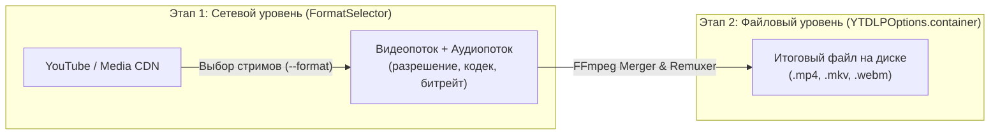

# Конфигурация YTDLPOptions

Библиотека `async-yt-dlp` предоставляет класс `YTDLPOptions` (неизменяемый frozen dataclass), который гарантирует строгую типизацию настроек, валидацию и защиту от опечаток.

Вместо ненадежных сырых строк библиотека предоставляет объектные построители `FormatSelector` и `OutputTemplate`, а также строгое перечисление `VideoContainer`.

---

## 1. Основные категории параметров

### Выбор формата (`FormatSelector` или строка)

Основной способ задания формата — использование объектного построителя `FormatSelector`.

#### Универсальная фабрика `FormatSelector.resolution()`
Позволяет сформировать селектор для **любого разрешения** с поддержкой контейнера, ограничения частоты кадров и строгого соответствия:

```python
from async_yt_dlp import FormatSelector, VideoContainer, YTDLPOptions

# Базовый выбор (лучшее видео до указанной высоты + лучшее аудио):
FormatSelector.resolution(720)

# С принудительным приоритетом контейнера (сначала родной MP4, fallback на перепаковку):
FormatSelector.resolution(1080, container=VideoContainer.MP4)

# С ограничением FPS (например, не выше 60 кадров/сек):
FormatSelector.resolution(1080, container=VideoContainer.MP4, fps=60)

# Строгое соответствие разрешению (без отката на меньшие высоты):
FormatSelector.resolution(1080, exact=True)
```

#### Готовые пресеты качества
```python
# Стандартная линейка разрешений YouTube (container опционален, по умолчанию лучший стрим):
FormatSelector.preset_144p()
FormatSelector.preset_240p()
FormatSelector.preset_360p()
FormatSelector.preset_480p()
FormatSelector.preset_720p()   # HD
FormatSelector.preset_1080p()  # Full HD
FormatSelector.preset_1440p()  # 2K (или preset_2k)
FormatSelector.preset_2160p()  # 4K UHD (или preset_4k)
FormatSelector.preset_4320p()  # 8K UHD (или preset_8k)

# Специальные пресеты:
FormatSelector.preset_max_quality()          # Максимальное доступное качество
FormatSelector.preset_worst()                # Минимальный размер (для превью / экономии)
FormatSelector.preset_best_audio()           # Лучший доступный звук любого формата
FormatSelector.preset_audio_only("mp3")      # Только аудио в заданном формате
FormatSelector.preset_compatibility()        # H.264 + AAC для старых плееров
FormatSelector.preset_telegram(max_size_mb=50) # С лимитом на вес файла для Telegram
```

#### Динамический опрос разрешений и оценка размеров для ботов
Для создания интерфейсов ботов с инлайн-кнопками объект `MediaInfo` предоставляет удобные методы:

```python
info = await ytdlp.extract_info(url, download=False)

# Список всех реально доступных на сервере разрешений (например, [1080, 720, 360, 144]):
resolutions = info.get_available_resolutions()

# Генерация кнопок с расчетным размером файла:
for res in resolutions:
    size_str = info.estimate_size_str(res)  # Например, "~62.01 MiB"
    print(f"Кнопка: {res}p ({size_str})")
```

---

### Разделение ответственности и конвейер загрузки (принцип DRY)

Частая ошибка разработчиков — указание `container` одновременно в `FormatSelector` и в `YTDLPOptions`:

```python
# ❌ ИЗБЫТОЧНО (нарушает принцип DRY):
options = YTDLPOptions(
    format=FormatSelector.preset_720p(container=VideoContainer.MP4),
    container=VideoContainer.MP4,
)
```

В конвейере скачивания медиа библиотека разделяет задачи на два независимых этапа:



#### Сравнение этапов и зон ответственности

| Параметр | Где задаётся | Уровень абстракции | Что делает | Когда использовать |
|---|---|---|---|---|
| `FormatSelector.preset_720p()` / `FormatSelector.resolution(720)` | `options.format` | **Сетевой уровень** | Выбирает наилучшие потоки видео и звука с сервера (по высоте, битрейту, fps) | **Всегда** для выбора качества загрузки |
| `YTDLPOptions(container=VideoContainer.MP4)` | `options.container` | **Файловый уровень** | Гарантирует расширение и контейнер `.mp4` локального файла на диске (быстрый ремуксинг через FFmpeg) | **Всегда**, когда приложению или боту нужен гарантированный формат (например, MP4) |
| `FormatSelector.resolution(720, container=VideoContainer.MP4)` | `options.format` | **Сетевой уровень** | Принудительно ищет на сервере только нативные MP4-стримы | **Только если** на сервере отсутствует FFmpeg и ремуксинг невозможен |

#### Рекомендуемый каноничный паттерн (чистый DRY):

```python
# ✅ КАНОНИЧНЫЙ КОД ПО DRY:
options = YTDLPOptions(
    # Выбираем ТОЛЬКО качество видео:
    format=FormatSelector.resolution(720),  # или FormatSelector.preset_720p()
    # Задаем ТОЛЬКО формат итогового файла:
    container=VideoContainer.MP4,
    output_path=Path("./downloads"),
    output_template=OutputTemplate.title_only(),
)
```

> [!IMPORTANT]
> На YouTube видеопотоки высокого качества (1080p, 2K, 4K) и аудиопотоки с максимальным битрейтом практически всегда хранятся в контейнерах WebM (кодеки VP9, AV1, Opus).
> 
> Если указать `container=VideoContainer.MP4` в `FormatSelector`, yt-dlp будет пытаться найти нативный MP4 на стороне YouTube, которого может не существовать в заданном разрешении, либо он будет иметь худший битрейт.
> 
> Оставляя `FormatSelector` отвечать только за разрешение (`format=FormatSelector.resolution(720)`), а `container=VideoContainer.MP4` передавая в `YTDLPOptions`, вы получаете **максимальное качество видео и звука**, упакованное локальным FFmpeg в чистый и совместимый `.mp4`.


### Пути, шаблоны имен и контейнер файлов

Для построения шаблонов имен файлов используется объектный построитель `OutputTemplate`:

```python
from pathlib import Path
from async_yt_dlp import OutputTemplate, VideoContainer, YTDLPOptions

options = YTDLPOptions(
    # Шаблон имени файла:
    output_template=OutputTemplate.title_and_id(),  # "%(title)s [%(id)s].%(ext)s"
    # Либо построитель с оператором деления:
    # output_template=OutputTemplate().channel() / OutputTemplate.title_only(),
    
    # Целевой каталог сохранения и временная директория:
    output_path=Path("/var/media/downloads"),
    temp_path=Path("/tmp/ytdlp_cache"),
    
    # Гарантия контейнера на выходе (ffmpeg remux):
    container=VideoContainer.MP4,
    
    # Ограничения файловой системы:
    restrict_filenames=True,  # Только безопасные ASCII символы
    windows_filenames=True,   # Защита от запрещенных символов Windows
    no_overwrites=True,       # Не перезаписывать существующие файлы
)
```

### Среда выполнения JavaScript (EJS)

YouTube использует внешнее исполнение JavaScript (EJS) для расшифровки `n-sig` параметров и подтверждения легитимности клиента. Без JS-рантайма YouTube ограничивает доступные форматы (например, скрывает 1080p/4K) и троттлит скорость отдачи.

В `async-yt-dlp` автоматическое обнаружение доступных в системе JS-рантаймов включено по умолчанию:

```python
from async_yt_dlp import YTDLPOptions

# Поведение по умолчанию (auto_detect_js=True):
# Библиотека автоматически ищет Node.js, Deno, Bun в системном PATH
# и передает найденные движки в yt-dlp без необходимости ручной настройки.
options = YTDLPOptions(auto_detect_js=True)

# Ручная настройка конкретного JS-рантайма (при необходимости переопределения):
options = YTDLPOptions(
    auto_detect_js=False,
    js_runtimes={
        "node": {"path": "/usr/local/bin/node"},
    },
)
```

### Логирование и подавление служебного шума

yt-dlp выводит множество служебных предупреждений в поток `stderr` (включая некритичные предупреждения об отсутствующих форматах, экстракторах и т.д.).

```python
from async_yt_dlp import YTDLPOptions

# По умолчанию no_warnings=True:
# Служебные предупреждения yt-dlp перехватываются адаптером YTDLPLoggerAdapter
# и переводятся на уровень DEBUG, не засоряя консоль и стандартный поток вывода.
options = YTDLPOptions(no_warnings=True)

# Если необходимо видеть все оригинальные предупреждения yt-dlp:
options = YTDLPOptions(no_warnings=False)

# Полное отключение информационных сообщений:
options = YTDLPOptions(quiet=True)
```

### Сеть и прокси
```python
YTDLPOptions(
    proxy="socks5://127.0.0.1:1080",
    socket_timeout=30.0,
    impersonate="chrome",  # Маскировка TLS-fingerprint через curl_cffi
    http_headers={
        "User-Agent": "Custom-Agent/1.0",
        "Referer": "https://example.com",
    },
)
```

### Авторизация и Cookies
```python
from pathlib import Path

YTDLPOptions(
    cookies_file=Path("/etc/cookies/youtube.txt"),
    cookies_from_browser="firefox",  # Загрузка cookies напрямую из профиля браузера
    username="user@example.com",
    password="my_password",
)
```

### Постобработка и ffmpeg
```python
from pathlib import Path

YTDLPOptions(
    extract_audio=True,
    audio_format="mp3",    # mp3, m4a, flac, opus, wav
    audio_quality="192K",
    embed_thumbnail=True,  # Встроить обложку в аудио/видео
    embed_metadata=True,   # Записать метатеги (название, автор, альбом)
    embed_subtitles=True,  # Встроить субтитры в контейнер
    ffmpeg_location=Path("/opt/homebrew/bin/ffmpeg"),
)
```

---

## 2. Использование `raw_options` для forward-compatibility

Если в новой версии `yt-dlp` появилась новая опция, которой еще нет в типизированных полях `YTDLPOptions`, вы можете передать ее напрямую через словарь `raw_options`:

```python
options = YTDLPOptions(
    format=FormatSelector.preset_max_quality(),
    raw_options={
        "concurrent_fragment_downloads": 4,
        "geo_bypass": True,
        "hls_prefer_native": True,
    },
)
```

> [!NOTE]
> Значения из `raw_options` имеют **наивысший приоритет** и переопределяют любые типизированные поля.

---

## 3. Слияние конфигураций (Merging)

Вы можете определить базовую конфигурацию на уровне клиента и переопределять отдельные параметры в конкретных вызовах `extract_info` или `download`:

```python
from pathlib import Path
from async_yt_dlp import AsyncYTDLP, FormatSelector, YTDLPOptions

# Базовые настройки для всего клиента
client_options = YTDLPOptions(
    output_path=Path("./downloads"),
    proxy="socks5://127.0.0.1:9050",
    retries=5,
)

async with AsyncYTDLP(default_options=client_options) as ytdlp:
    # 1. Скачивание обычного видео (используются базовые настройки)
    await ytdlp.download("https://...")

    # 2. Скачивание только аудио (переопределяем format и включаем extract_audio)
    # output_path, proxy и retries унаследуются из client_options автоматически!
    await ytdlp.download(
        "https://...",
        options=YTDLPOptions(
            format=FormatSelector.preset_audio_only("mp3"),
            extract_audio=True,
            audio_format="mp3",
        ),
    )
```

---

## 4. Безопасное логирование

Для вывода параметров в логи или отладки используйте метод `.to_safe_dict()`:

```python
print(options.to_safe_dict())
# Пароли, токены, учетные данные прокси и cookies будут замаскированы звездочками (********)
```
